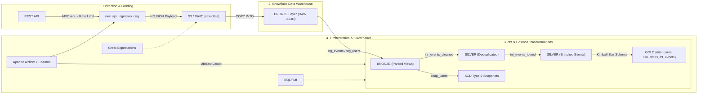

# Enterprise Modern Data Stack (MDS) Pipeline

[](https.github.com)
[](https://getdbt.com)
[](https://airflow.apache.org)

An enterprise-grade, end-to-end data pipeline implementing the **Modern Data Stack architecture**. This project ingests raw REST API payloads, lands data in Object Storage (S3/MinIO), stages records into **Snowflake Data Warehouse**, transforms raw variant JSON into Medallion architecture layers (**Bronze, Silver, Gold Kimball Star Schema**) via **dbt**, and orchestrates workflows using **Apache Airflow & Astronomer Cosmos**.

---

## 🏗 Architecture & Data Flow



---

## 📁 Repository Directory Structure

```text
enterprise-mds-pipeline/
├── .github/
│   └── workflows/
│       ├── ci.yml                 # Runs pytest, sqlfluff, and dbt compile on PRs
│       └── cd.yml                 # Deployment / linting checks
│
├── dags/
│   ├── __init__.py
│   ├── raw_api_ingestion_dag.py   # Airflow DAG: API extract -> S3/MinIO -> Snowflake Raw
│   ├── dbt_cosmos_transform_dag.py# Airflow DAG: Executes dbt Silver & Gold models via Cosmos
│   └── utils/
│       ├── __init__.py
│       ├── api_client.py          # Custom API extraction logic with rate limiting
│       ├── snowflake_hooks.py     # Snowflake connection & stage loader utilities
│       └── alert_callbacks.py     # Discord/Slack webhook failure alert functions
│
├── dbt_project/
│   ├── dbt_project.yml            # Main dbt configuration file
│   ├── packages.yml               # dbt external dependencies (e.g., dbt-utils, dbt-expectations)
│   ├── profiles.yml               # Warehouse connection profile (Snowflake / DuckDB)
│   │
│   ├── macros/
│   │   ├── generate_surrogate_key.sql
│   │   └── audit_metadata.sql     # Custom Jinja macros for load metadata
│   │
│   ├── models/
│   │   ├── staging/               # BRONZE LAYER: Views casting raw JSON
│   │   │   ├── src_external_api.yml
│   │   │   ├── stg_events.sql
│   │   │   └── stg_users.sql
│   │   │
│   │   ├── intermediate/          # SILVER LAYER: Deduplicated & cleansed tables
│   │   │   ├── int_events_cleaned.sql
│   │   │   └── int_events_joined.sql
│   │   │
│   │   └── marts/                 # GOLD LAYER: Kimball Star Schema
│   │       ├── core/
│   │       │   ├── schema.yml     # Data contracts and integrity tests
│   │       │   ├── dim_users.sql  # Dimension Table
│   │       │   ├── dim_dates.sql  # Date/Time Dimension Table
│   │       │   └── fct_events.sql # Incremental Fact Table
│   │
│   ├── snapshots/                 # SCD Type-2 tracking
│   │   └── snap_users.sql
│   │
│   └── tests/                     # Custom singular/business logic SQL tests
│       └── assert_positive_metrics.sql
│
├── great_expectations/            # Data Quality Checkpoints
│   ├── great_expectations.yml
│   ├── checkpoints/
│   │   └── raw_payload_checkpoint.yml
│   └── expectations/
│       └── raw_api_suite.json
│
├── sql/
│   └── ddl/
│       ├── 01_init_snowflake_db.sql # Sets up Warehouses, DBs, Roles, and Schemas
│       └── 02_create_stages.sql     # External stage pointing to S3/MinIO
│
├── tests/                         # Unit tests for custom ingestion scripts
│   ├── __init__.py
│   ├── test_api_client.py
│   └── test_dag_integrity.py      # Checks Airflow DAGs for import errors and cycles
│
├── .env.example                   # Environment variable template (keys, DB creds)
├── .gitignore
├── .sqlfluff                      # SQLFluff config for consistent dbt SQL linting
├── Dockerfile                     # Custom Airflow image with dbt & Python dependencies
├── docker-compose.yml             # Airflow Webserver, Scheduler, Postgres, MinIO
├── Makefile                       # Quick CLI targets (make up, make dbt-run, make test)
├── README.md                      # Architecture diagram, setup guide, and tech details
└── requirements.txt               # astronomer-cosmos, dbt-snowflake, boto3, etc.
```

---

## ⚡ Quickstart & Setup Guide

### 1. Prerequisites
- **Docker Desktop** (version 20+ with Docker Compose v2)
- **Python 3.10+**
- (Optional) **Snowflake Account** for cloud target deployment

### 2. Environment Configuration
Copy the `.env.example` template to `.env`:
```bash
cp .env.example .env
```

### 3. Launch Local Pipeline Infrastructure
Start Postgres, Airflow Webserver, Airflow Scheduler, and MinIO S3 emulator:
```bash
make up
```
Access services locally:
- **Airflow UI**: [http://localhost:8080](http://localhost:8080) (`admin` / `admin`)
- **MinIO Console**: [http://localhost:9001](http://localhost:9001) (`minioadmin` / `minioadmin`)

---

## 🧪 Testing & Data Quality Verification

### Run Python Unit & DAG Integrity Tests
```bash
make test
```

### Run SQLFluff Linter on dbt SQL Models
```bash
make lint
```

### Execute dbt Transformations Locally (DuckDB Target)
```bash
make dbt-deps
make dbt-run
make dbt-test
```

---

## 🚀 CI/CD Pipeline

- **Continuous Integration (`.github/workflows/ci.yml`)**: Triggered on PRs. Runs `pytest` DAG validation, `sqlfluff` linting, and `dbt compile` against DuckDB.
- **Continuous Deployment (`.github/workflows/cd.yml`)**: Triggered on merge to `main`. Validates dbt manifest artifacts for production release.

---

## 📄 License
Distributed under the MIT License.
